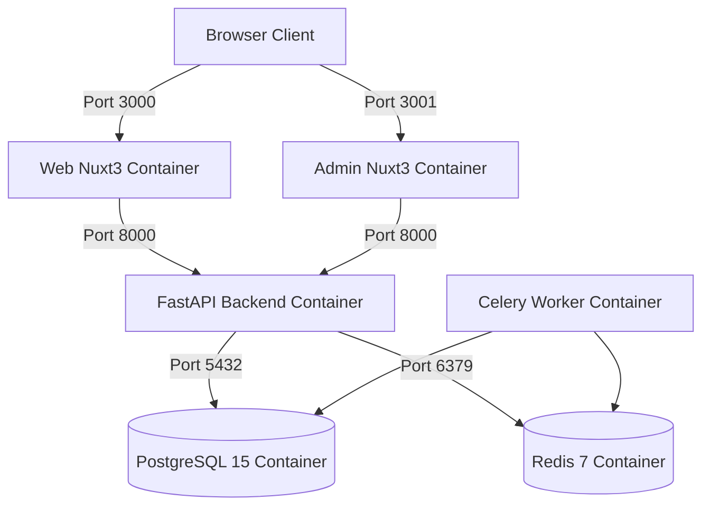

# Docker & Docker Compose Deployment Guide

This guide explains how to deploy **VidGen** in containerized environments using Docker and Docker Compose.

---

## 🐳 Architecture Overview

VidGen's containerized stack comprises 6 services managed under `docker-compose.yml`:



---

## 🚀 Quick Deployment Steps

### 1. Clone & Configure Environment

```bash
git clone https://github.com/ucmao/vidgen.git
cd vidgen
```

Ensure API keys and secrets are populated in environment variables or passed to `docker-compose.yml`.

### 2. Start All Services

```bash
docker compose up -d
```

### 3. Check Container Health

```bash
docker compose ps
```

All 6 containers (`vidgen-db`, `vidgen-redis`, `vidgen-backend`, `vidgen-celery-worker`, `vidgen-web`, `vidgen-admin`) should report `running` or `healthy`.

---

## 🛠️ Management Commands

### Viewing Real-time Logs
```bash
# All services
docker compose logs -f

# Specific backend/worker logs
docker compose logs -f backend celery_worker
```

### Stopping Services
```bash
docker compose down
```

### Rebuilding Containers (after code updates)
```bash
docker compose up -d --build
```

---

## 🌐 Production Nginx Reverse Proxy Setup

For production HTTPS and domain routing:

```nginx
# Web Frontend (yourdomain.com)
server {
    listen 80;
    server_name yourdomain.com;
    location / {
        proxy_pass http://127.0.0.1:3000;
        proxy_set_header Host $host;
        proxy_set_header X-Real-IP $remote_addr;
    }
}

# Admin Panel (admin.yourdomain.com)
server {
    listen 80;
    server_name admin.yourdomain.com;
    location / {
        proxy_pass http://127.0.0.1:3001;
        proxy_set_header Host $host;
        proxy_set_header X-Real-IP $remote_addr;
    }
}

# FastAPI Backend API (api.yourdomain.com)
server {
    listen 80;
    server_name api.yourdomain.com;
    location / {
        proxy_pass http://127.0.0.1:8000;
        proxy_set_header Host $host;
        proxy_set_header X-Real-IP $remote_addr;
    }
}
```
